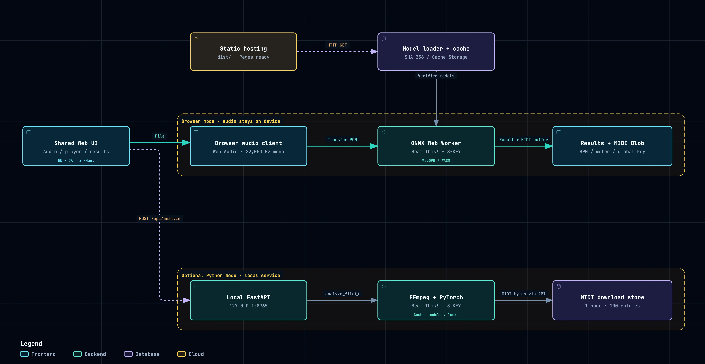

[繁體中文](README.md) · [English](README.en.md)



# Key & Tempo — 音樂 BPM、調性與 MIDI 速度圖

拖入音訊即自動分析全曲，也可選取指定範圍分析 BPM、拍號與調性，並下載可匯入音樂製作軟體的 MIDI Tempo 檔案。預設直接在瀏覽器執行 ONNX 模型，也能在同一頁切換至本機 Python 服務。

[Main 正式版](https://hikari-tsai.github.io/music-detection/) · [Staging 預覽版](https://hikari-tsai.github.io/music-detection/staging/)

日常使用請選 Main；若要試用尚未合併至 main 的變更，請選 Staging。

[GitHub 儲存庫](https://github.com/Hikari-Tsai/music-detection) · [架構圖原圖](docs/diagrams/key-tempo-system.webp) · [互動架構圖原始檔](docs/diagrams/key-tempo-architecture.html) · [MIT 授權](LICENSE)

## 功能

- **節拍與拍號**：以 Beat This! 偵測拍點、小節首拍，再推算 BPM 與每小節拍數。
- **固定／平均／變速**：固定速度顯示 BPM；確認變速時顯示平均 BPM，並提供逐拍變速 MIDI。資訊不足以確認固定或變速時，顯示平均值。
- **範圍選取**：拖入後自動分析全曲並顯示波形。若只分析片段，可用同一條滑桿的雙把手或秒數選取、試聽，再按「分析選取範圍」。支援兩種引擎，原始檔案不會被修改。
- **整首／片段調性**：以 S-KEY 估計 12 個大調與 12 個小調之一，例如 G 大調、A 小調。
- **MIDI 下載**：輸出速度與可判定的拍號，不包含音符、和弦或調性事件。
- **兩種分析引擎**：Browser ONNX 與 Local Python 共用檔案拖放、播放、結果與下載介面。
- **三語介面**：英文、日文、繁體中文共用同一份 HTML，由前端切換；依瀏覽器語言自動選擇，其餘語言使用英文，手動選擇優先並儲存。

支援 WAV、MP3、FLAC、M4A、OGG、AIFF、AAC、MP4、MOV，單檔上限 100 MiB、20 分鐘。瀏覽器實際可解碼的格式與可處理的長度，仍取決於裝置和記憶體；S-KEY 至少需要 3 秒音訊。

MP4／MOV 僅分析影片內的音軌，不分析影像。含 AAC 音軌的 MP4／MOV，以及含 PCM 音軌的 MOV，均已在本機 Chrome 測試；瀏覽器支援仍取決於內部音訊編碼，副檔名不保證可解碼。無法解碼時，可明確切換至 Local Python 以 FFmpeg 擷取音訊，或先匯出 WAV／MP3；影片若沒有音軌，則無法分析。Local Python 使用第一條音軌，目前不提供多音軌選擇。影片同樣計入 100 MiB 檔案限制，音訊長度最多 20 分鐘。

## 系統架構

| 模式 | 處理流程 | 音訊與下載 |
| --- | --- | --- |
| **Browser ONNX（預設）** | Web Audio 解碼為 22,050 Hz 單聲道 → Web Worker 前處理與 ONNX 推論 → BPM、拍號、調性與 MIDI | 音訊留在瀏覽器，MIDI 在前端產生 |
| **Local Python（選用）** | 共用 UI → FastAPI → FFmpeg 解碼 → PyTorch 模型 → 結果與 MIDI API | 音訊送至同一台電腦的服務，暫存音訊在處理後刪除 |

瀏覽器模式的 Beat This! 優先使用 WebGPU，必要時退回 WASM CPU；S-KEY 使用 WASM CPU。模型載入會驗證 SHA-256，並在可用時使用瀏覽器快取。首次載入需要下載模型及執行引擎；純靜態部署不需要持續運行 Python 或 Node.js。

Python 服務固定使用 `http://127.0.0.1:8765`，目前以 CPU 執行模型。MIDI 暫存在服務記憶體中，最多保留一小時、100 筆；服務停止或重新啟動後，原下載即失效。

切換引擎會分析目前選取的範圍，分析與下載期間會鎖住切換控制。ONNX 失敗不會自動上傳音訊給 Python；每次重新整理仍預設 Browser ONNX。

## 模型下載、備援與快取

瀏覽器 ONNX 模式優先從 Hugging Face 下載兩個模型，只有該來源失敗才切換到網站提供的備援模型。音訊仍留在使用者裝置，Hugging Face 僅提供模型與設定檔。

| 模型 | 用途 | ONNX 檔案大小 | 主要來源 | 正式網站備援路徑 |
| --- | --- | --- | --- | --- |
| Beat This! `final0` | 拍點、小節首拍 | 約 82.1 MB | [aaatmy/beat-this-onnx](https://huggingface.co/aaatmy/beat-this-onnx) | `models/beat-this-final0.onnx` |
| S-KEY | 全曲大調／小調 | 約 0.325 MB | [aaatmy/skey-onnx](https://huggingface.co/aaatmy/skey-onnx) | `models/skey/skey.onnx` |

下載網址固定至 Hugging Face 的特定 revision，由 [model-sources.js](frontend/inference/model-sources.js) 管理。正式網站的備援來源為 GitHub Pages；本機預覽則使用本機伺服器，進度顯示 `Local server`。ONNX Runtime 的 JavaScript／WASM 檔案仍由網站提供，首次載入的總流量會大於上表中的模型大小。Python 模式維持原有的 PyTorch 權重下載流程。

### 下載進度與失敗處理

- 依目前選擇的英文、日文或繁體中文，顯示來源、下載百分比及模型驗證狀態。
- 連線失敗、HTTP 錯誤、設定格式錯誤、檔案大小或 SHA-256 不符時，切換至備援來源，並在後續下載進度中保留切換原因。
- 等待回應或下一段資料超過 **30 秒** 時視為逾時；這不是整個檔案的下載期限，持續收到資料的慢速下載會繼續。
- 切換時重新取得備援來源的 manifest、必要前處理設定與模型。不同平台匯出的 ONNX 雜湊可能不同，不能混用兩個來源的檔案。
- 兩個來源都失敗時會提示檢查網路並重新選檔。S-KEY 載入失敗仍保留已完成的 BPM 分析與 Tempo MIDI。

例如：`Hugging Face 無法使用，改從 GitHub Pages 載入。原因：伺服器回應錯誤 · GitHub Pages: 首次下載模型 42%`。

### 快取與再次使用

模型通過驗證後會嘗試存入瀏覽器 Cache Storage，依 SHA-256 區分版本。再次使用時，符合目前版本的有效快取可略過模型檔下載；快取無法使用或被清除時會重新下載。設定檔、網頁及 runtime 仍需可載入，因此不保證完全離線使用。

來源版本、更新模型的方式與技術細節見 [瀏覽器 ONNX 文件](docs/browser.md)。

## 快速開始

### 直接使用線上版

1. 開啟 [Main 正式版](https://hikari-tsai.github.io/music-detection/) 或 [Staging 預覽版](https://hikari-tsai.github.io/music-detection/staging/)，維持預設的 **Browser ONNX**。
2. 拖入音訊後會自動分析全曲；首次分析會下載模型。
3. 若只想分析片段，使用雙把手或秒數調整範圍，試聽後按「分析選取範圍」。
4. 查看 BPM、拍號與調性，按下下載按鈕取得固定或變速的 MIDI Tempo 檔案。

選取範圍至少需 1 秒，S-KEY 調性分析至少需 3 秒；較短片段仍可嘗試 BPM 分析。修改範圍會清除舊結果與下載，避免誤用上一段的分析。按「整首音訊」可恢復完整範圍。

片段的 MIDI 時間軸從選取起點算起，並保留片段內第一拍的偏移；請與裁切片段使用相同起點。若在原音訊時間軸使用，需對齊所選起點，例如選取 30–60 秒，就對齊原音訊的第 30 秒。下載檔名會帶上起訖秒數。此工具選取分析範圍，不會另存裁切後的音訊檔案。

Browser ONNX 在瀏覽器解碼整首並快取 PCM，僅將選取取樣交給模型；Local Python 將原檔與範圍傳給本機 FastAPI，由 FFmpeg 解碼後裁切，兩個模型都只分析片段。兩種模式仍受原檔 100 MiB／20 分鐘上限限制。使用片段分析前，請更新本機 Python 專案並重新啟動 FastAPI；舊版服務不支援範圍時，前端會拒絕採用整首結果。若瀏覽器無法解碼或取得長度，可先用 Local Python 分析整首；取得長度後即可選取範圍，但瀏覽器可能仍無法試聽。

線上版不需要安裝 Python 或 Node.js。只有開發、自行建置或使用 Local Python 引擎時，才需要下列環境。

以下終端機指令皆在**專案根目錄**執行。macOS 可在終端機輸入 `cd `（含空格），拖入專案資料夾，再按 Enter。首次安裝與匯出需要網路連線下載依賴及模型權重。

### 自行建置瀏覽器 ONNX 版

從原始碼首次建置，需要 Node.js 22、Python 3.12、uv 與 Git。Python 用於匯出模型；建置完成後，使用網頁的人不必安裝 Python。

```sh
npm ci
uv python install 3.12
test -d .venv || uv venv --python 3.12 .venv
uv pip install --python .venv/bin/python -r requirements-onnx.txt
.venv/bin/python scripts/export_onnx.py
.venv/bin/python scripts/export_skey_onnx.py
npm run build
npm run serve
```

開啟 [瀏覽器版介面](http://127.0.0.1:8766/)，拖入音訊即自動分析全曲，也可調整範圍後按下分析。之後只需執行 `npm run serve`，macOS 也可雙擊 `start_frontend.command`。

若已具備 `assets/onnx/` 中的兩個模型、manifest 與前處理資料，可跳過 Python 安裝及匯出步驟。修改前端後執行 `npm run build` 更新 `dist/`；不要直接修改建置產物。

### Local Python 版（macOS／Windows／Linux）

Local Python 是由 **Uvicorn 啟動的 FastAPI HTTP 服務**，在瀏覽器所在的同一台電腦執行，位址為 `http://127.0.0.1:8765`。前端透過 HTTP API 與 Python 通訊：

| 請求 | 用途 |
| --- | --- |
| `POST /api/analyze` | 以 `multipart/form-data` 的 `file` 欄位傳送音訊，指定片段時另帶 `start_seconds` 與 `end_seconds`；Python 執行模型後回傳 JSON 分析結果與 `download_url` |
| `GET /api/download/{token}` | 依分析結果中的下載網址取得 MIDI，回應類型為 `audio/midi` |

音訊會送往這台電腦上的 FastAPI 服務，由 FFmpeg／PyTorch 處理，不會送至 Hugging Face。Hugging Face 優先下載與 GitHub 備援的流程適用於 Browser ONNX；Python 使用自身的模型權重載入流程。

先下載或 clone 完整專案，確認根目錄包含 `web_app.py` 與 `requirements.txt`。macOS／Linux 使用終端機；Windows 使用 **PowerShell**。工具安裝後請重新開啟終端機，執行 `cd "path/to/music-detection"`（替換成實際路徑）回到專案根目錄，再執行 Python 安裝與啟動指令。

#### macOS

先依 [Homebrew 官方說明](https://brew.sh/) 安裝 Homebrew，再安裝工具：

```sh
brew install uv ffmpeg git
```

首次安裝 Python 依賴：

```sh
uv python install 3.12
test -d .venv || uv venv --python 3.12 .venv
uv pip install --python .venv/bin/python -r requirements.txt
```

之後每次使用只需雙擊 `start_ui.command`，或執行：

```sh
.venv/bin/python -m uvicorn web_app:app --host 127.0.0.1 --port 8765
```

#### Windows 10／11（PowerShell）

使用 WinGet 安裝工具。若找不到 `winget`，請先依 [Microsoft 安裝說明](https://learn.microsoft.com/windows/package-manager/winget/) 安裝或更新 App Installer。

```powershell
winget install --id astral-sh.uv -e
winget install --id Git.Git -e
winget install --id Gyan.FFmpeg -e
```

安裝完成後**重新開啟 PowerShell**，回到專案根目錄，再執行：

```powershell
uv python install 3.12
if (-not (Test-Path .venv)) { uv venv --python 3.12 .venv }
uv pip install --python .\.venv\Scripts\python.exe -r requirements.txt
```

每次啟動服務：

```powershell
.\.venv\Scripts\python.exe -m uvicorn web_app:app --host 127.0.0.1 --port 8765
```

這裡直接使用虛擬環境的 Python，不必執行 `Activate.ps1` 或修改 PowerShell 的執行政策。`start_ui.command` 是 macOS 用的啟動檔，Windows 請使用上述指令。

#### Linux（Ubuntu／Debian）

以下以 Ubuntu／Debian 為例，先安裝系統工具，再使用 [uv 官方安裝方式](https://docs.astral.sh/uv/getting-started/installation/)：

```sh
sudo apt update
sudo apt install -y git curl ffmpeg
curl -LsSf https://astral.sh/uv/install.sh | sh
```

其他 Linux 發行版請使用對應的套件管理器安裝 `git`、`curl`、`ffmpeg`。完成後重新開啟終端機，回到專案根目錄，再執行：

```sh
uv python install 3.12
test -d .venv || uv venv --python 3.12 .venv
uv pip install --python .venv/bin/python -r requirements.txt
```

每次啟動服務：

```sh
.venv/bin/python -m uvicorn web_app:app --host 127.0.0.1 --port 8765
```

三個平台都使用 Python 3.12，建立環境的指令會保留既有 `.venv`。若已有環境，請確認其 Python 版本；從其他作業系統複製來的 `.venv` 無法直接共用，須在目標系統另行建立。

#### 確認啟動與使用

看到 `Uvicorn running on http://127.0.0.1:8765` 代表 FastAPI 服務已啟動。開啟 [本機服務介面](http://127.0.0.1:8765/)，將 **Analysis engine** 切換為 **Local Python**，再選取音訊。分析期間保持終端機開啟；使用完畢按 `Control + C` 停止服務。首次分析會下載模型權重，需要網路連線。

本機服務頁面同樣預設 ONNX；若只安裝 Python 依賴、尚未匯出模型及建立 `dist/`，請先選擇 Local Python。若要在此頁使用 ONNX，須完成前一節建置，服務會從 `/runtime/` 提供 `dist/` 資源。

網頁中的三語教學提供可展開的 macOS、Windows 與 Linux 安裝指令，連線失敗時會自動展開教學。本機服務已在 macOS 驗證；Windows 與 Linux 尚未完成對應系統的端到端實測。

| 狀況 | 處理方式 |
| --- | --- |
| 無法連線 | 確認 FastAPI 在同一台電腦的 8765 埠執行，並開啟本機服務網址；服務啟動後移除音訊再加入重試 |
| `ModuleNotFoundError` 或找不到 `.venv` | 完成依賴安裝；macOS／Linux 使用 `.venv/bin/python`，Windows 使用 `.\.venv\Scripts\python.exe`；確認目前位於專案根目錄 |
| 找不到 `uv`、`git` 或 `ffmpeg` | 依作業系統的安裝指令補齊工具，重新開啟終端機以載入 PATH；分別以 `uv --version`、`git --version`、`ffmpeg -version` 確認 |
| `Address already in use` | 8765 已被使用；若是既有服務可直接使用，或在原終端機按 `Control + C` 停止後重啟 |

## 分支與 GitHub Pages 部署

同一個 Pages 網站同時提供兩個分支的前端：

| 分支 | 網址 | 用途 |
| --- | --- | --- |
| [`main`](https://github.com/Hikari-Tsai/music-detection/tree/main) | [正式版](https://hikari-tsai.github.io/music-detection/) | 正式網站版本 |
| [`staging`](https://github.com/Hikari-Tsai/music-detection/tree/staging) | [Staging 預覽版](https://hikari-tsai.github.io/music-detection/staging/) | 驗證尚未合併至 main 的變更 |

### 自動部署流程

[Pages 工作流程](.github/workflows/pages.yml) 在推送到 `main` 或 `staging` 時自動觸發。開始執行時先記錄兩個分支當下的 commit，再各自 checkout、安裝依賴、匯出模型、測試及建置；任一建置失敗，該次部署就不會發布。

兩份建置結果會合併為同一個 Pages artifact：`main` 放在網站根目錄，`staging` 放在 `staging/`。每個版本保留自己的模型、runtime、前處理設定與相對路徑，避免跨分支混用檔案。部署會同時發布兩份內容，因此更新其中一個分支不會移除另一個版本，也不會把 staging 的 UI 當成正式版發布。

工作流程以同一個 concurrency group 排程，避免兩次部署互相覆蓋。執行中的工作不會因後續推送而取消；等候中的工作可能被更新的推送取代，下一次執行會重新取得兩個分支的最新 commit。兩個分支都須保留此雙版本部署工作流程，避免舊的單版本工作流程重新覆蓋整站。

分享預覽使用 [`frontend/ui/og-image.jpg`](frontend/ui/og-image.jpg)（1200 × 630），並在 HTML 中提供 Open Graph 與 X／Twitter 大圖卡片標籤，不需要執行 JavaScript。圖片與分享文案統一使用英文。Actions 依建置分支設定 `SITE_URL`，讓 main 與 staging 各自使用正確的頁面與圖片絕對網址；本機建置預設正式站網址，部署至其他網址時可透過 `SITE_URL` 環境變數覆寫。

### 設定與手動部署

1. 在 **Settings → Pages** 將來源設為 **GitHub Actions**。
2. 在 **Settings → Environments → github-pages** 的部署分支規則中允許 `main` 與 `staging`。
3. 推送任一分支，或到 **Actions → Build and deploy browser ONNX app → Run workflow**，選擇 `main` 或 `staging` 手動觸發。手動執行也會建置並發布兩個分支，不會改變兩個版本的網址。其他分支不執行此部署流程。

Actions 的部署摘要會列出兩個網址。各版本的 `deployment.json` 記錄實際發布的分支與 commit，可用來確認目前站上版本：[正式版紀錄](https://hikari-tsai.github.io/music-detection/deployment.json) · [Staging 紀錄](https://hikari-tsai.github.io/music-detection/staging/deployment.json)。將 staging 變更合併至 main 後，才會成為正式版內容。

若從 Pages 網站使用 Local Python，仍須在使用者電腦上啟動服務，並明確允許網站來源。先停止既有服務，再執行：

macOS／Linux：

```sh
TEMPO_ALLOWED_ORIGINS=https://YOUR-NAME.github.io .venv/bin/python -m uvicorn web_app:app --host 127.0.0.1 --port 8765
```

Windows PowerShell：

```powershell
$env:TEMPO_ALLOWED_ORIGINS="https://YOUR-NAME.github.io"
.\.venv\Scripts\python.exe -m uvicorn web_app:app --host 127.0.0.1 --port 8765
```

請將 `YOUR-NAME` 換成網站帳號；來源只含協定與網域，不加儲存庫路徑，多個來源以逗號分隔。本機 `localhost`、`127.0.0.1`、`::1` 來源已允許。網站存取本機服務仍受瀏覽器網路政策限制；若受阻，可改用本機服務頁面或 Browser ONNX。線上 Pages 與其本機服務連線情境尚未驗證。

## PR-Agent 自動審查

[PR Agent 工作流程](.github/workflows/pr-agent.yml) 使用 [官方開源 GitHub Action](https://docs.pr-agent.ai/installation/github/)，在同一儲存庫的 PR 建立、重新開啟、轉為可審查或推送新提交時，自動以繁體中文產生 review。草稿、機器人事件與 fork PR 的自動審查會略過。

首次啟用請至儲存庫 **Settings → Secrets and variables → Actions → New repository secret**，新增 `OPENAI_KEY`，填入可使用所選模型的 OpenAI API 金鑰。`GITHUB_TOKEN` 由 GitHub 自動提供，不必自行建立。預設模型為 `gpt-5.6`；如需變更，可在同頁的 **Variables** 新增 `PR_AGENT_MODEL`。未設定金鑰時，工作流程會明確提示缺少設定，不會執行模型審查。

PR-Agent 會將 PR 的程式碼差異與相關內容送至模型 API，使用 API 配額；這是開發階段的程式碼審查，與網站在裝置上分析音訊的流程分開。

儲存庫擁有者、成員與協作者也可在 PR 一般留言區單獨輸入下列指令（整則留言僅包含該指令）：

| 指令 | 功能 |
| --- | --- |
| `/review` | 重新審查 PR |
| `/describe` | 產生或更新 PR 說明 |
| `/improve` | 提供程式碼改善建議 |

自動流程只執行 review；PR 說明與改善建議由上述留言指令觸發。工作流程不 checkout 或執行 PR 程式碼，僅透過 GitHub API 讀取內容並發表結果。Action 原始碼固定於 v0.45.0 對應提交；其上游 Dockerfile 使用可更新的 `github_action` 映像標籤，容器內容並未鎖定 digest。

設定 Secret 後，建立一個非草稿 PR，或在既有 PR 留言 `/review`，即可驗證實際模型回覆；可於 **Actions → PR Agent** 查看執行結果。此工作流程不是功能測試，不應取代前後端測試。

## 檔案結構

```text
music-detection/
├── frontend/
│   ├── ui/
│   │   ├── index.html            # 兩種引擎共用的三語頁面
│   │   ├── og-image.jpg          # 1200 × 630 社群分享縮圖
│   │   ├── audio-source.js      # 瀏覽器解碼、完整波形與取樣裁切
│   │   ├── range-editor.js      # 範圍滑桿、秒數與驗證
│   │   ├── app.js                # 檔案、播放、分析狀態與 MIDI 下載
│   │   ├── engine.js             # Browser ONNX／Local Python 介接
│   │   ├── messages.js           # 英文、日文、繁體中文翻譯
│   │   ├── i18n-core.js          # 語言偵測、訊息與參數處理
│   │   ├── i18n.js               # 畫面翻譯更新與語言偏好
│   │   ├── style.css             # 介面與手機版樣式
│   │   └── banner.js / banner.css # Banner 動態效果
│   └── inference/
│       ├── client.js             # 瀏覽器音訊解碼與 Worker 通訊
│       ├── worker.js             # Beat This! 推論與分析流程
│       ├── dsp.js                # 頻譜前處理與拍點後處理
│       ├── model-assets.js       # 來源切換、下載進度、雜湊驗證與快取
│       ├── model-sources.js      # Hugging Face 固定版本下載網址
│       ├── key-engine.js / key.js # S-KEY 推論與類別解讀
│       └── tempo.js              # BPM 判定與 MIDI 二進位編碼
├── backend/
│   ├── app.py                    # FastAPI 路由、上傳驗證與跨來源設定
│   ├── analysis.py               # FFmpeg 解碼與 Beat This! 分析
│   ├── tempo.py                  # Python BPM 判定與 MIDI 編碼
│   ├── key_analysis.py           # S-KEY 全曲調性分析與錯誤隔離
│   ├── skey_model.py             # 固定版本權重下載、驗證與載入
│   ├── models/skey/              # 保留上游授權的 S-KEY 推論原始碼
│   ├── downloads.py              # 有容量與期限的 MIDI 記憶體快取
│   ├── config.py                 # 路徑、格式、檔案大小與時長限制
│   └── cli.py                    # 命令列分析工具
├── scripts/
│   ├── export_onnx.py            # 匯出 Beat This! 並驗證數值一致性
│   ├── export_skey_onnx.py       # 匯出 S-KEY 並建立比較資料
│   ├── build_frontend.mjs        # 打包程式、模型、執行引擎與授權
│   ├── serve_frontend.mjs        # 本機靜態網站伺服器
│   ├── prepare_web_fixtures.py   # 產生前後端比較用測試資料
│   └── test_*browser.mjs         # 真實模型與瀏覽器流程測試
├── shared/skey-keys.json         # Python／JavaScript 共用的 24 調類別順序
├── tests/js/、tests/python/      # 演算法、API、MIDI、快取與翻譯測試
├── samples/                     # 範例音訊、來源資訊與原始授權聲明
├── third_party/                 # 第三方授權與 ONNX Runtime notices
├── docs/
│   ├── diagrams/                # README 架構圖、互動圖與驗證紀錄
│   ├── architecture.md          # 模組邊界與重構決策
│   ├── browser.md               # ONNX 部署、限制與驗證
│   ├── skey.md                  # S-KEY 來源、匯出與一致性驗證
│   └── experiment.md            # Beat This! 原始實驗紀錄
├── .github/workflows/
│   ├── pages.yml                # GitHub Pages 建置與部署
│   └── pr-agent.yml             # PR 自動審查與成員留言指令
├── web_app.py                   # Python 網頁服務的相容入口
├── run_beat_this.py              # Beat This! 命令列相容入口
├── convert_tempo.py              # MIDI Tempo 轉換相容入口
├── start_ui.command             # macOS：啟動 Python 服務
├── start_frontend.command       # macOS：啟動靜態前端
├── requirements.txt             # Python 執行依賴
├── requirements-onnx.txt        # 額外的 ONNX 匯出與驗證依賴
├── requirements-frozen.txt      # 初次 Python 環境版本快照
├── package.json / package-lock.json # 前端依賴、版本鎖定與工作指令
├── README.md                   # 繁體中文說明
├── README.en.md                # 英文說明
└── LICENSE                     # 本專案 MIT 授權
```

以下為本機依賴或可再生資料，已由 `.gitignore` 排除，不隨原始碼提交：

| 目錄 | 用途 |
| --- | --- |
| `assets/onnx/` | 匯出的 ONNX 模型、前處理常數與 manifest；建置時複製至 `dist/models/` |
| `dist/` | 完整可部署的靜態網站 |
| `.cache/` | Python 模型權重及跨語言比較資料 |
| `results/` | 命令列分析輸出、MIDI 與節拍試聽音訊 |
| `.venv/`、`node_modules/`、`vendor/` | 本機執行依賴與上游原始碼工作副本 |

修改功能時，UI 放在 `frontend/ui/`，瀏覽器推論放在 `frontend/inference/`，Python 分析放在 `backend/`。BPM 與 MIDI 邏輯需維持兩種語言的一致性。新增介面文字請集中於 `messages.js`，靜態文字使用 `data-i18n`，動態文字使用 `setText`。

## 測試與限制

完成前述環境安裝與模型匯出後，執行：

```sh
# 首次測試或模型更新時建立比較資料
.venv/bin/python scripts/prepare_web_fixtures.py
npm test
npm run test:python
npm run format:check

# 先在另一個終端機執行 npm run serve；瀏覽器測試需要 Chrome
npm run test:browser
npm run test:skey-browser

# 另需啟動本機 Python 服務，驗證引擎切換與跨來源 MIDI 下載
npm run test:engines-browser

# 選取範圍、試聽、ONNX／Python 片段分析與 MIDI
npm run test:range-browser

# MP4／MOV 音軌、範圍分析與無音軌錯誤（另需 FFmpeg）
npm run test:video-browser
```

測試包含固定／平均／變速判定、Python 與 JavaScript 頻譜及拍點比較、S-KEY 分數一致性、MIDI 編碼、模型快取、來源切換、逾時與檔案損壞、下載到期、三語介面與錯誤復原。`TEST_URL` 可指定瀏覽器測試網址；網址附加 `?engine=wasm` 可強制瀏覽器使用 CPU。

目前驗證範圍（2026-09-17）：

| 情境 | 結果 |
| --- | --- |
| 本機 Chrome，範圍分析 | 拖放、試聽、ONNX／Python 第 5–20 秒分析均為 68.015 BPM／G 大調，MIDI 長度約 15 秒；恢復整首為 68.007 BPM。三語及 320／390／1440 px 排版通過 |
| 本機 Chrome，WebGPU／WASM | 固定與變速分析、MIDI 下載、三語切換及錯誤復原通過 |
| 本機模擬 Hugging Face 故障 | 兩個模型從本機備援完整下載並分析成功；雙來源失敗訊息及重新選檔重試通過 |
| 正式 GitHub Pages，Hugging Face 正常 | 兩個模型實際下載、BPM／調性分析、MIDI 產生及重新整理後的快取使用通過 |
| 正式 GitHub Pages，S-KEY 主要來源故障 | GitHub Pages 備援模型下載、驗證及調性分析通過 |
| 正式 GitHub Pages，Beat This! 主要來源故障 | 來源切換與三語進度顯示正確；完整下載超過該次 120 秒測試等待上限，尚未完成此情境的線上端到端驗證 |

上述 120 秒是瀏覽器測試的等待上限，與程式的 30 秒「無資料傳輸」逾時不同。手機尺寸測試僅代表排版，Safari、Firefox 與實體手機仍待驗證。

模型可能判成半速／倍速，漏拍與抖動也會反映在速度圖中；固定或變速是依模型拍點及容差推算，並非原始樂曲的人工標註。每個拍點按四分音符解讀，拍號無法可靠判定時不強行填入。

S-KEY 對整首或所選片段提供單一大調／小調估計，不定位轉調或辨識和弦；其分數不是經校準的準確率。移植一致性測試驗證的是實作結果相近，不代表模型對所有音樂都能正確辨識。

## 致謝與引用

感謝以下研究作者與開源維護者提供模型、工具及實作。本專案整合其成果，加入瀏覽器 ONNX 推論、雙引擎介面、BPM 判定與 MIDI 匯出流程。

### 模型與相關論文

1. **Beat This!** — Francesco Foscarin、Jan Schlüter、Gerhard Widmer，*Beat this! Accurate beat tracking without DBN postprocessing*，ISMIR 2024。[論文](https://arxiv.org/abs/2407.21658) · [官方程式與模型](https://github.com/CPJKU/beat_this)。本專案使用 `final0`，依賴固定於 `b95c8ab0c58c2d9fcfd40508ae8dffbc05ac4f5c`。
2. **S-KEY** — Yuexuan Kong、Gabriel Meseguer-Brocal、Vincent Lostanlen、Mathieu Lagrange、Romain Hennequin，*S-KEY: Self-supervised Learning of Major and Minor Keys from Audio*，ICASSP 2025。[論文](https://arxiv.org/abs/2501.12907) · [官方程式與模型](https://github.com/deezer/skey)。本專案使用 `918b83d273568d5041569bb8068843d19a335726` 版本的推論程式與權重，詳細處理見 [S-KEY 文件](docs/skey.md)。
3. **nnAudio** — K. W. Cheuk 等人，*nnAudio: An on-the-Fly GPU Audio to Spectrogram Conversion Toolbox Using 1D Convolutional Neural Networks*，IEEE Access，2020。[論文 DOI](https://doi.org/10.1109/ACCESS.2020.3019084) · [官方程式](https://github.com/KinWaiCheuk/nnAudio)。用於 S-KEY 的頻譜前處理。
4. **ConvNeXt** — Zhuang Liu 等人，*A ConvNet for the 2020s*，CVPR 2022。[論文](https://arxiv.org/abs/2201.03545) · [官方程式](https://github.com/facebookresearch/ConvNeXt)。S-KEY 所含的 ConvNeXt 實作註明源自 Meta FAIR，本專案保留相應授權。

### 致謝

本專案使用了以下兩個 Repo 提供的程式碼與模型資源，感謝作者與維護者的分享：

- [CPJKU/beat_this](https://github.com/CPJKU/beat_this)：用於節拍與小節首拍偵測。
- [deezer/skey](https://github.com/deezer/skey)：用於音樂調性辨識。

### 使用的套件與工具

| 套件／工具 | 在本專案中的用途 |
| --- | --- |
| [ONNX](https://github.com/onnx/onnx)、[ONNX Runtime／Web](https://github.com/microsoft/onnxruntime) | 模型交換格式、Python 匯出驗證、瀏覽器 WebGPU／WASM 推論 |
| [PyTorch](https://github.com/pytorch/pytorch)、[TorchAudio](https://github.com/pytorch/audio) | 原生模型執行、音訊特徵與模型匯出 |
| [NumPy](https://github.com/numpy/numpy)、[SoundFile](https://github.com/bastibe/python-soundfile) | 數值運算與音訊讀寫 |
| [FFmpeg](https://ffmpeg.org/) | Python 服務的音訊解碼、轉單聲道及重取樣 |
| [fft.js](https://github.com/indutny/fft.js) | 瀏覽器 FFT 與頻譜計算 |
| [Mido](https://github.com/mido/mido) | Python MIDI 檔案建立與事件編碼 |
| [FastAPI](https://github.com/fastapi/fastapi)、[Uvicorn](https://github.com/encode/uvicorn)、[python-multipart](https://github.com/Kludex/python-multipart) | 本機 HTTP 服務及音訊上傳 |
| [HTTPX](https://github.com/encode/httpx)、[tqdm](https://github.com/tqdm/tqdm) | API 測試與命令列進度顯示 |
| [esbuild](https://github.com/evanw/esbuild)、[Prettier](https://github.com/prettier/prettier)、[Playwright](https://github.com/microsoft/playwright) | 前端打包、程式格式與瀏覽器驗證 |
| [uv](https://github.com/astral-sh/uv)、[Node.js](https://nodejs.org/)、[npm](https://github.com/npm/cli) | Python 環境、前端依賴與開發工作流程 |

直接依賴與版本以 [package.json](package.json)、[package-lock.json](package-lock.json)、[requirements.txt](requirements.txt) 及 [requirements-onnx.txt](requirements-onnx.txt) 為準；上表不逐項展開間接依賴。

範例 `samples/choice.ogg` 來自 librosa 範例音訊，原作為 Admiral Bob feat. Snowflake 的 **Choice**，鼓與貝斯節錄由 Brian McFee 處理。感謝原作者與整理者；來源、檔案雜湊及原始授權聲明保留於 [source.json](samples/source.json) 與 [choice.txt](samples/choice.txt)。此範例未附經驗證的拍點標準答案。

## 授權

本專案原創程式碼採用 **MIT License**，Copyright © 2026 Hikari Tsai。完整條款見 [LICENSE](LICENSE)；套件中繼資料同樣標示為 MIT，靜態建置會附上此授權檔。

第三方程式、模型權重與範例音訊保留各自的授權，並不因本專案採 MIT 而改變。[third_party/](third_party/) 保存隨附元件的授權與 notices，建置時複製至 `dist/licenses/`。S-KEY 原始碼的授權亦保留於 [backend/models/skey/LICENSE](backend/models/skey/LICENSE)。

範例音訊的原始聲明包含 **Creative Commons Attribution Noncommercial** 條件，並非 MIT；使用或散布時請依 [原始聲明](samples/choice.txt) 處理。
