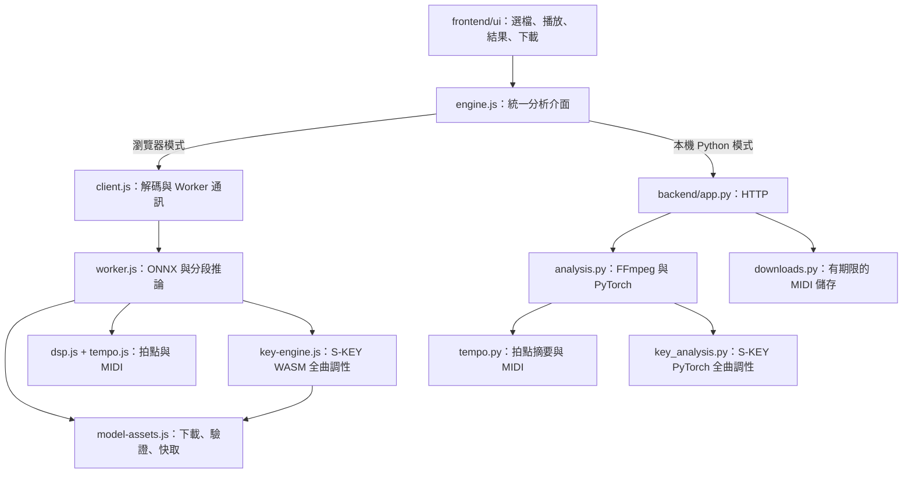

# 架構檢視與重構決策

目前功能規模適合原生 JavaScript UI、Web Worker 與小型 FastAPI 服務。部署、運算和介面分開；尚不需要導入前端框架、微服務或資料庫。加入 S-KEY 後，拍點演算法、速度判定門檻與 MIDI 格式維持原樣，分析結果新增獨立調性欄位。

## 已處理的問題

| 原本狀況 | 影響 | 現在做法 |
| --- | --- | --- |
| `static/` 與 `browser/` 平行擺放、測試混在根目錄 | 難以區分前端來源、後端與測試 | `frontend/ui/`、`frontend/inference/`、`backend/`、`tests/` |
| UI handler 直接選擇 `fetch` 或 Worker，並散布版本文案 | 修改引擎容易碰到 DOM 流程 | `ui/engine.js` 提供相同 `analyze(file, onProgress)` 介面及版本文案 |
| 建置腳本替換中文句子與特定 JS 版本字串 | 文案變更可能讓部署版本設定悄悄失效 | HTML 明確標記 `data-engine`，建置只切換 metadata 與資產 URL；UI adapter 選擇文案 |
| `web_app.py` 包含路由、FFmpeg、模型與下載字典 | HTTP 和運算綁定，快取難以單獨驗證 | `app.py` 管 HTTP，`analysis.py` 管解碼與模型，`downloads.py` 管儲存 |
| Worker 同時負責下載、快取、驗證及推論 | 資源錯誤與模型問題難以分開測 | `model-assets.js` 專管資產及可選快取，Worker 保留模型生命週期與推論流程 |
| Cache Storage 的 `match` 失敗不在例外保護內 | 禁止快取的瀏覽器可能無法分析 | 快取開啟／讀取失敗均可退回下載；快取與下載均驗證 SHA-256 |
| 建置直接覆蓋 `dist/` | 已刪除的舊模組可能殘留在發布產物 | 每次 build 清空並重建 `dist/`；只修改來源目錄 |
| 研究結果與開發說明混在 README | 新使用者難以找到啟動與部署方式 | README 保留操作與目錄；研究紀錄、瀏覽器細節和本文件拆到 `docs/` |

原有音訊、權重、ONNX 及研究結果均保留。`results/` 為可再生輸出，新增 Git 忽略；`samples/` 與授權資訊保留在原始碼中。

## 執行路徑

`dist/` 的預設 Browser ONNX 模式沒有音訊 API 依賴，預覽 Node 服務只提供靜態檔案。同頁可手動切換 Local Python，透過本機 `http://127.0.0.1:8765/api/analyze` 和 `/api/download/{token}` 操作。Python 服務載入同一套 UI 原始碼，預設也為 ONNX，並由 `/runtime/` 提供 `dist/` 的模型與推論引擎；相容入口 `web_app:app` 保留。

UI 切換引擎會重新分析已選檔案並清除舊結果；分析與下載期間鎖定選擇，避免競態。引擎選擇不持久化，語言偏好獨立保存。Python API 允許本機前端來源的 CORS；公開網站來源須透過 `TEMPO_ALLOWED_ORIGINS` 明確設定。JSON 的相對下載路徑由前端 adapter 轉成 Python 服務的絕對 URL，避免誤向靜態網站請求 MIDI。

## 跨引擎結果契約

UI 使用以下共同欄位：`filename`、`duration_seconds`、`analysis_seconds`、`beat_count`、`downbeat_count`、`waveform`、`result`、`tempo_mode`、`download_url`。

- `result` 是 `{bpm, signature_beats}` 或 `-1`；未知拍號為 `null`。
- `tempo_mode` 為 `constant`、`variable`、`average` 或 `unavailable`。
- Python 分析服務內部回傳 MIDI bytes，只有 HTTP 層才建立下載 URL。
- 瀏覽器 Worker 回傳可轉移的 MIDI ArrayBuffer；client 才建立 Blob URL，UI 在重設時撤銷。
- 瀏覽器額外回傳 `engine` 和原始拍點，供狀態與比對使用。
- 兩版均回傳 `key`、`key_status`、`key_reason`。成功時 `key` 包含官方索引、調名、主音、大小調與原模型分數；失敗或資料不足為 `null`，不阻止 tempo/MIDI 回傳。契約與比對見 [S-KEY](skey.md)。

## 保留的設計與後續界線

1. **保留 Python／JavaScript 的兩份 tempo 實作。** 執行環境不同，讓瀏覽器呼叫 Python 會破壞純靜態託管；把 Python 硬搬進 WASM 也增加依賴。以同一份 Python 產生的頻譜、分數、拍點與 MIDI fixture 比對 JS，並用已知節拍測試防止兩邊一起出錯。
2. **保留原生 UI。** 現在只有單頁、單檔分析；抽出 engine adapter 已足以隔離傳輸。若將來加入批次任務、編輯速度圖、多頁狀態，再評估元件框架。
3. **保留單一 Worker，各模型分別快取。** UI 只允許一次分析一個檔案；Beat This! 與 S-KEY 各自管理 session，Python 各有模型快取與 lock。調性接續節拍分析，不需要額外 Worker 或任務佇列。
4. **本機下載快取維持記憶體。** 過期一小時、容量 100 筆，服務重啟即失效。若未來轉成多程序或遠端服務，才需要共用儲存、身分驗證與更完整的工作排程。
5. **不在此次調整 beat-to-MIDI 的音樂語意。** 每拍按四分音符解讀、30 ms 判定容差、未知拍號省略等行為保持；漏拍、倍速和實際 DAW 小節相位應作為獨立功能驗證。

## 驗證方式

`npm test` 檢查頻譜、後處理、分段邊界、tempo/MIDI 跨語言一致性與模型快取；`npm run test:python` 檢查 API、CLI 轉換及下載期限／容量；`npm run test:browser` 執行真實模型的 GPU／CPU、子路徑、下載、變速、錯誤復原和手機尺寸操作。

Beat This! 沿用既有 ONNX；S-KEY 由獨立匯出腳本產生，先與原生 PyTorch 比對，再以 `npm run test:skey-browser` 驗證瀏覽器 24 類分數、模型下載失敗與重試。實體手機、Safari、Firefox、線上 GitHub Pages 與多人遠端部署仍不在目前驗證範圍。
